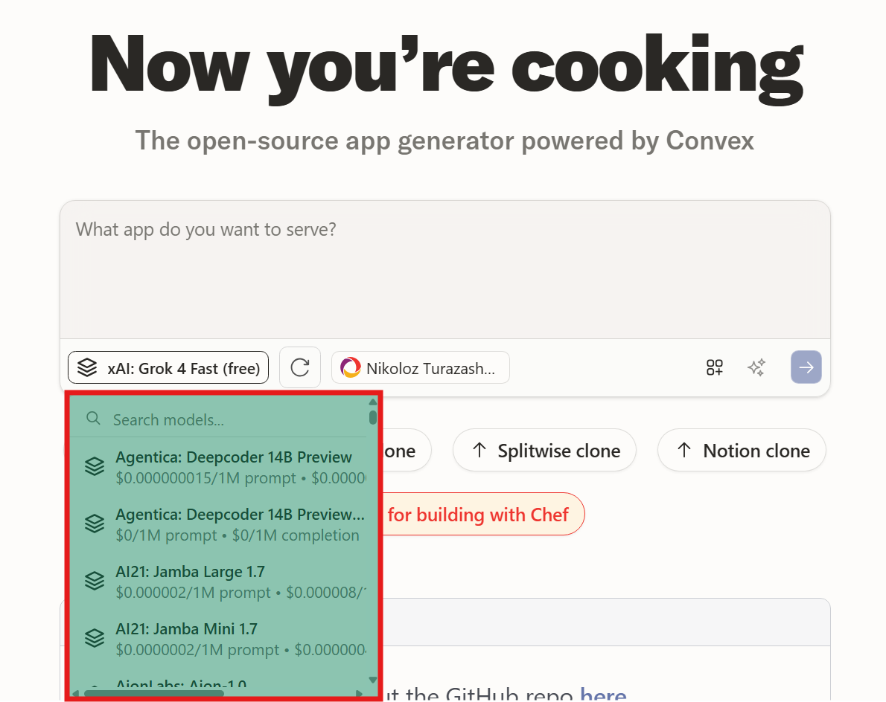

<p align="center">
  <picture>
    <source media="(prefers-color-scheme: dark)" srcset="https://chef.convex.dev/github-header-dark.svg">
    
  </picture>
</p>

# Chef with OpenRouter Integration

This is a fork of [Chef](https://chef.convex.dev) that replaces the multi-provider AI system with [OpenRouter](https://openrouter.ai), giving you access to **200+ AI models** from dozens of providers through a single, unified interface.

## What's Different in This Fork

- **Single Provider, Unlimited Models**: Access Claude, GPT-4, Gemini, Llama, and 200+ other models through OpenRouter
- **Dynamic Model Discovery**: New models appear automatically without code changes
- **Real-time Pricing**: See cost per 1M tokens for every model
- **Simplified Setup**: One API key gives you access to everything
- **Cost Optimization**: Choose the best price/performance ratio for each task

### Model Selection Interface



*Choose from 200+ AI models with real-time pricing and search functionality*

## Original Chef Features

Chef builds full-stack web apps with a built-in database, zero config auth, file uploads, real-time UIs, and background workflows. Chef's capabilities are enabled by being built on top of [Convex](https://convex.dev), the open-source reactive database designed to make life easy for web app developers.

**Original project**: [get-convex/chef](https://github.com/get-convex/chef)  
**Forked from**: `stable` branch of [bolt.diy](https://github.com/stackblitz-labs/bolt.diy)

## Quick Start with OpenRouter

### Prerequisites

1. **Get an OpenRouter API key** (free tier available): [openrouter.ai/keys](https://openrouter.ai/keys)
2. **Create a Convex account**: [convex.dev](https://convex.dev)

### Clone and Run

```bash
git clone https://github.com/turazashvili/chef-openrouter.git
cd chef-openrouter
git checkout openrouter-integration
```

Follow the setup instructions below, but **only add your OpenRouter API key** in step 5.

### Running Locally

Note: This will use the hosted Convex control plane to provision Convex projects. However, Chef tokens used in this enviroment will not count towards usage in your Convex account.

**1. Clone this OpenRouter fork**

```bash
git clone https://github.com/turazashvili/chef-openrouter.git
cd chef-openrouter
git checkout openrouter-integration
```

**2. Set up local environment**

Run the following commands in your terminal:

```bash
nvm install
nvm use
npm install -g pnpm
pnpm i
echo 'VITE_CONVEX_URL=placeholder' >> .env.local
npx convex dev --once # follow the steps to create a Convex project in your team
```

Note: `nvm` only works on Mac and Linux. If you are using Windows, you may have to find an alternative.

**3. Set up Chef OAuth application**

Go to the Convex [dashboard](https://dashboard.convex.dev/team/settings/applications/oauth-apps) and create an OAuth application. The team you use to create the application will be the only team you can sign-in with on local Chef. Redirect URIs will not matter, but you can set one to http://127.0.0.1:5173 (or whatever port you’ll run the Chef UI on) so that the form can be submitted.

**4. Set up Convex deployment**

Use `npx convex dashboard` to open the Convex [dashboard](https://dashboard.convex.dev) and go to Settings → Environment Variables. Then, set the following environment variables:

```env
BIG_BRAIN_HOST=https://api.convex.dev
CONVEX_OAUTH_CLIENT_ID=<value from oauth setup>
CONVEX_OAUTH_CLIENT_SECRET=<value from oauth setup>
WORKOS_CLIENT_ID=<value from .env.development>
```

**5. Add your OpenRouter API key**

Add your OpenRouter API key to `.env.local` to access 200+ AI models:

```env
OPENROUTER_API_KEY=<your openrouter api key from https://openrouter.ai/keys>
```

**5b. Set OpenRouter API key in Convex environment**

You also need to set the same OpenRouter API key in your Convex environment for server-side functions (like message summarization) to work properly:

```bash
npx convex env set OPENROUTER_API_KEY <your openrouter api key>
```

**That's it!** No need for multiple provider API keys. OpenRouter gives you access to:
- Claude models (3.5 Sonnet, Haiku, Opus)
- GPT models (4, 4-turbo, 3.5-turbo)
- Gemini models (Pro, Flash)
- Llama models (including fine-tuned variants)
- 200+ other models from various providers

You can also add your API key through the Chef settings page after starting the application.

**6. Run Chef backend and frontend**

Run the following commands in your terminal:

```bash
pnpm run dev

## in another terminal
npx convex dev
```

Congratulations, you now have Chef with OpenRouter integration running locally! You can log in to Chef with your existing Convex account.

Note: Chef is accessible at http://127.0.0.1:{port}/ and will not work properly on http://localhost:{port}/.

## OpenRouter Features

### Model Selection
- **200+ models available** in the model selector dropdown
- **Real-time pricing** displayed for each model (cost per 1M tokens)
- **Search and filter** through available models
- **Automatic updates** when new models are added to OpenRouter

### Cost Optimization
- **Compare pricing** across different providers for similar capabilities
- **Switch models instantly** based on task complexity
- **Use cheaper models** for simple tasks, premium models for complex ones

### Manual Model Refresh
Click the refresh button next to the model selector to fetch the latest available models from OpenRouter.

### Recommended Models
- **anthropic/claude-3.5-sonnet** - Best for complex reasoning and coding
- **openai/gpt-4** - Great general-purpose model
- **meta-llama/llama-3.1-8b-instruct** - Cost-effective for simpler tasks
- **google/gemini-pro** - Good for multimodal tasks

## Repository Layout

- `app/` contains all of the client side code and some serverless APIs.

  - `components/` defines the UI components
  - `lib/` contains client-side logic for syncing local state with the server
  - `routes/` defines some client and server routes

- `chef-agent/` handles the agentic loop by injecting system prompts, defining tools, and calling out to model providers.

- `chefshot/` defines a CLI interface for interacting with the Chef webapp.

- `convex/` contains the database that stores chats and user metadata.

- `template/` contains the template that we use to start all Chef projects.

- `test-kitchen/` contains a test harness for the Chef agent loop.

## Contributing

This fork focuses specifically on OpenRouter integration. For general Chef issues and features, please contribute to the [main Chef repository](https://github.com/get-convex/chef).

### OpenRouter-Specific Issues
If you find issues specific to the OpenRouter integration, feel free to open an issue or submit a pull request on this fork.

### Submitting to Upstream
I plan to submit this OpenRouter integration back to the main Chef repository. If you have suggestions for improving the integration before that happens, please let me know!

## Links

- **Original Chef**: [chef.convex.dev](https://chef.convex.dev)
- **Chef Documentation**: [docs.convex.dev/chef](https://docs.convex.dev/chef)
- **OpenRouter**: [openrouter.ai](https://openrouter.ai)
- **OpenRouter API Keys**: [openrouter.ai/keys](https://openrouter.ai/keys)
- **Convex**: [convex.dev](https://convex.dev)
